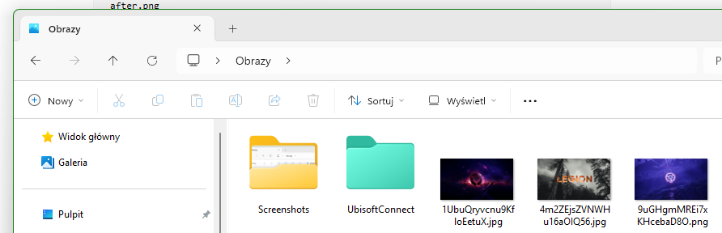
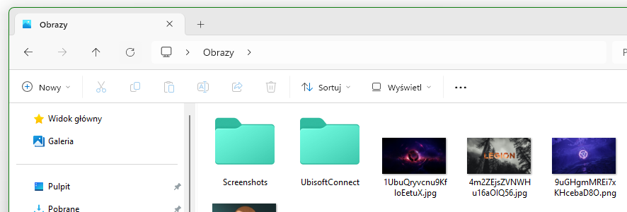

# Block Folder Thumbnail Cache

A Windhawk mod that prevents Windows File Explorer from generating preview thumbnails for folders while keeping file thumbnails enabled.

## Purpose

Windows 11 generates preview thumbnails for folders that contain images, videos, or other media files.

This can break visual consistency when using custom icon themes, because media folders may display generated preview thumbnails instead of the normal themed folder icon.

This mod is designed to solve that problem by blocking folder thumbnail generation while leaving normal file thumbnails untouched.

## Features

- Keeps thumbnails for images, videos, PDFs, and other supported file types.
- Blocks generated preview thumbnails for folders.
- Preserves normal folder icons from the current Windows icon theme.
- Does not force a specific folder icon, such as the default yellow Windows folder.
- Can remove the old `Logo` registry workaround if enabled.
- Can clear the Explorer thumbnail and icon cache once after installation or update.

## Resource Redirect compatibility

This mod can be used as a companion mod for users of the Windhawk **Resource Redirect** mod and icon packs such as `resource-redirect-icon-themes`.

Resource Redirect can replace normal Windows folder icons by redirecting system icon resources. However, folders that contain images or other media may still display generated folder preview thumbnails instead of the themed folder icon.

This mod complements Resource Redirect by preventing File Explorer from generating those folder preview thumbnails. As a result, custom folder icons provided by Resource Redirect or other icon theme methods are more likely to remain visible.

This mod is not an official add-on for Resource Redirect. It is an independent Windhawk mod intended to improve visual consistency when using custom folder icon themes.

## Screenshots

### Before

Folder preview thumbnails are generated for media folders.



### After

Folders use normal themed icons while files keep their thumbnails.



## Requirements

- Windows 11
- Windhawk
- Windows File Explorer

Optional:

- Resource Redirect
- Custom Windows icon theme
- `resource-redirect-icon-themes` or another icon replacement method

## Compatibility

Tested on:

- Windows 11
- Windows File Explorer
- Windhawk

This mod is primarily intended for Windows 11. It may also work on other Windows versions, but they are not officially tested.

Because File Explorer internals can change between Windows updates, compatibility may vary depending on the Windows build.

## How it works

The mod hooks `CoCreateInstance` and wraps the `IThumbnailCache` interface used by File Explorer.

When Explorer requests a thumbnail for a folder, the mod blocks that request.

For regular files, the original thumbnail behavior is left untouched.

As a result:

- folders should fall back to their normal themed icons,
- files should continue to show thumbnails normally.

## Why not use the `Logo` registry workaround?

A common workaround is to set the `Logo` registry value under:

```reg
HKCU\Software\Classes\Local Settings\Software\Microsoft\Windows\Shell\Bags\AllFolders\Shell
